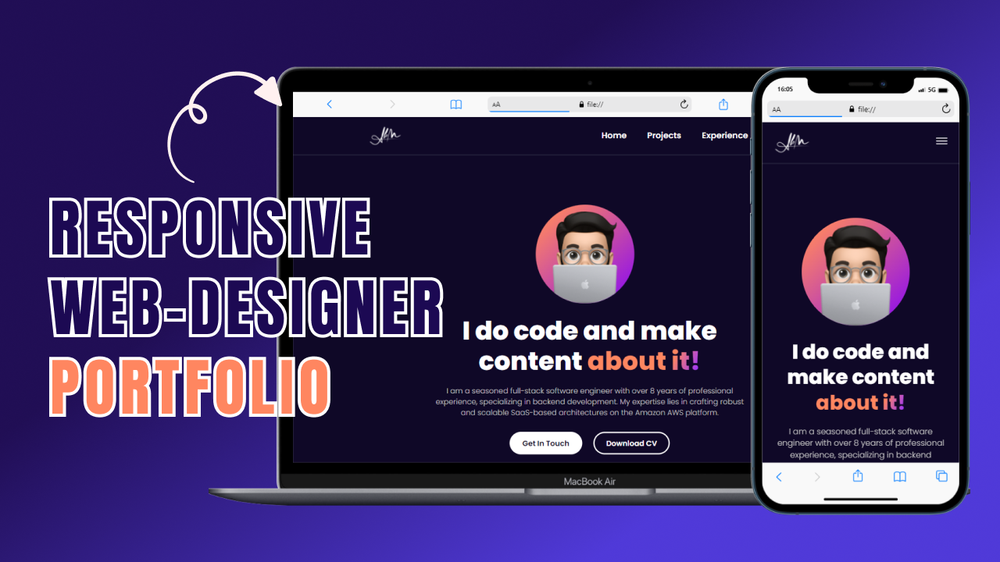

# Responsive Portfolio Website Design with HTML and CSS

[🎬 Watch ](https://youtu.be/c1_0MH0l4sw)

Welcome to this hands-on tutorial where we'll guide you through creating a responsive portfolio website using HTML and CSS. Whether you're a beginner or looking to sharpen your web development skills, this step-by-step guide is designed for you.

## Overview

In this tutorial video, we'll explore the fundamentals of web design, covering HTML markup and CSS styling. Learn how to structure your portfolio for visual appeal and ensure it looks fantastic on various devices, from desktops to mobile phones.

## What You'll Learn

- Basics of HTML and CSS
- Responsive design techniques
- Creating navigation menus
- Incorporating images
- Styling your content for a professional look
